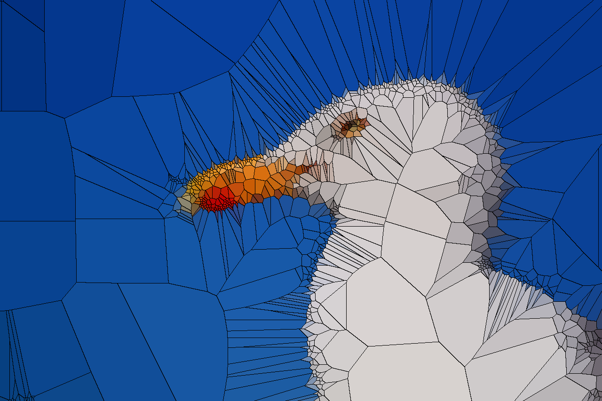

# voronoi_mosaic
画像の局所的な色のばらつきをもとに、ボロノイ分割の母点を逐次的に追加して描画していくスクリプト。

CLIで使用することを想定しており、引数として以下の指定を受け付ける。

positional arguments:
-  input_path            入力画像パス
-  seeds_per_region      1領域から追加する母点数
-  output_path           出力画像パス

options:
-  -h, --help            show this help message and exit
-  --max-seeds MAX_SEEDS
                        総母点数の上限 (default: 64)
-  --gif                 各ステップを GIF 保存する
-  --gif-path GIF_PATH   GIF の出力先 (default: output_path と同名の .gif)
-  --frame-duration FRAME_DURATION
                        GIF フレーム間隔[ms] (default: 180)
-  --no-boundary         境界線を描かない
-  --min-seed-distance MIN_SEED_DISTANCE
                        新規母点の最小間隔[pixel] (default: 4.0)
-  --delaubay           最終的に得られた母点を用いてドロネー三角形分割を適用した画像を作成する
-  --delaunay_output    ドロネー三角形分割を適用した画像の保存先。指定されなければoutput_pathに _delaunayを付けたものが出力される。
-  --no-delaunay-edge   ドロネー三角形分割の境界線を表示するかどうか。

# example 
背景が単色の塗りつぶしで、ある程度コントラストがはっきりしているとわかりやすくなると思われる。

[元画像のURL](https://pixabay.com/ja/photos/%E9%B4%8E-%E9%B3%A5-%E5%8B%95%E7%89%A9-%E3%82%AB%E3%83%A2%E3%83%A1-%E6%B5%B7%E9%B3%A5-517091/)

